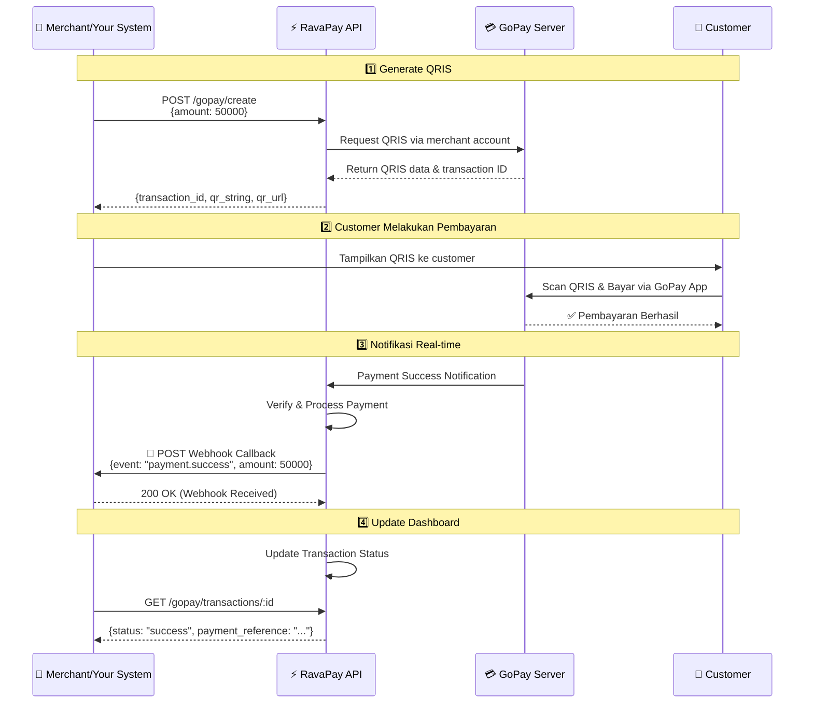
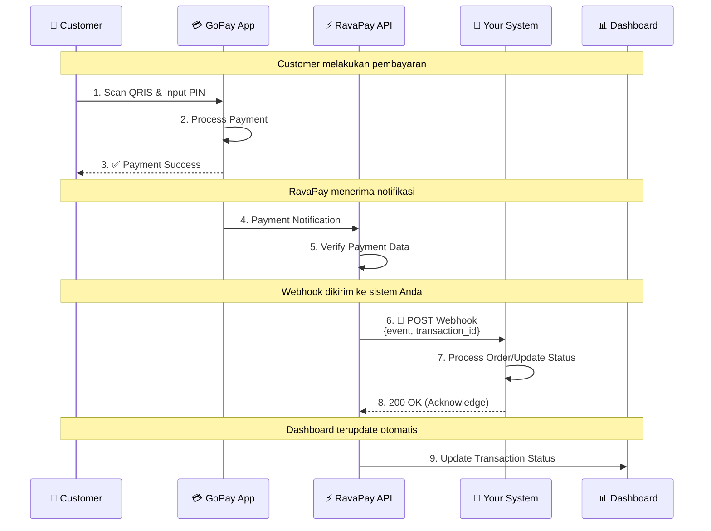

<div align="center">


<br/>

# RavaPay

**Platform otomasi pembayaran QRIS dengan API yang powerful untuk merchant Indonesia**

[](https://ravapay.biz.id)
[](https://t.me/RavaPayBot)
<br/>
[](https://stats.uptimerobot.com/0y8nSx5FN2)
[](https://stats.uptimerobot.com/0y8nSx5FN2)
[](https://stats.uptimerobot.com/0y8nSx5FN2)
[](https://stats.uptimerobot.com/0y8nSx5FN2)

</div>

---

RavaPay adalah platform yang memudahkan merchant untuk menerima pembayaran GoPay secara otomatis melalui QRIS. Dengan RavaPay, Anda dapat:

- Generate QRIS dinamis dengan nominal custom
- Cek status transaksi secara real-time
- Terima notifikasi otomatis via webhook
- Monitor semua transaksi di dashboard merchant
- Integrasi mudah dengan sistem Anda via REST API

---

### Generate QRIS Otomatis

Buat QRIS dinamis dengan nominal custom untuk setiap transaksi. Setiap QRIS memiliki Transaction ID unik untuk tracking yang akurat.

### Cek Status Real-time

Pantau status pembayaran secara real-time menggunakan Transaction ID. Tidak perlu khawatir dengan transaksi yang memiliki nominal sama.

### Webhook Callback

Terima notifikasi otomatis ke sistem Anda saat transaksi berhasil. Payload dikirim dengan tanda tangan HMAC-SHA256 untuk memastikan keaslian event.

### Dashboard Monitoring

Dashboard intuitif untuk monitoring semua transaksi, statistik pendapatan, dan performa bisnis Anda secara real-time.

### Keamanan & Keandalan

Data terenkripsi dengan standar industri. Kredensial GoPay Anda disimpan dengan enkripsi penuh — tidak pernah tersimpan dalam bentuk plaintext.

---

### Diagram Alur Sistem



---

### Alur Transaksi Step-by-Step

#### 1️⃣ Generate QRIS

Sistem Anda me-request QRIS dengan nominal tertentu melalui API. RavaPay akan meneruskan request ke server GoPay dan mengembalikan QRIS beserta Transaction ID.

**Request:**

```bash
curl -X POST https://api.ravapay.biz.id/gopay/create \
  -H "x-api-key: YOUR_API_KEY" \
  -H "Content-Type: application/json" \
  -d '{"amount": 50000, "description": "Order #1234"}'
```

**Response:** `201 Created`

```json
{
  "success": true,
  "message": "Payment QRIS created successfully",
  "data": {
    "transaction_id": "TRX-FD8492591A2B4C6D",
    "amount": 50000,
    "status": "pending",
    "qr_string": "00020101021226...",
    "qr_url": "https://api.ravapay.biz.id/qr/TRX-FD8492591A2B4C6D",
    "created_at": "2026-05-01T10:15:00.000Z",
    "expired_at": "2026-05-01T10:30:00.000Z"
  }
}
```

#### 2️⃣ Customer Bayar

Customer melakukan scan QRIS (via URL dari `qr_url` atau `qr_string`) menggunakan aplikasi GoPay dan menyelesaikan pembayaran.

#### 3️⃣ Webhook Callback (Real-time)

Segera setelah GoPay menyatakan pembayaran berhasil, RavaPay akan mengirim Webhook langsung ke server Anda.

**Diagram Webhook Flow**


**Webhook Payload:**

```json
{
  "event": "payment.success",
  "data": {
    "transaction_id": "TRX-FD8492591A2B4C6D",
    "status": "success",
    "amount": 50000,
    "description": "Order #1234",
    "customer_name": null,
    "customer_phone": null,
    "customer_email": null,
    "qr_string": "00020101021226...",
    "qr_url": "https://api.ravapay.biz.id/qr/TRX-FD8492591A2B4C6D",
    "created_at": "2026-05-01T10:15:00.000Z",
    "expired_at": "2026-05-01T10:30:00.000Z",
    "updated_at": "2026-05-01T10:17:43.000Z"
  },
  "timestamp": "2026-05-01T10:17:43.000Z"
}
```

> 📌 **Event types:** `payment.success` · `payment.expired` · `payment.cancel`
> Webhook dipicu setiap kali status transaksi berubah ke salah satu state di atas.

#### 🔐 Verifikasi Webhook Signature

Setiap webhook dilengkapi **HMAC-SHA256 signature** pada header `X-RavaPay-Signature` untuk keamanan. Gunakan **Webhook Secret** Anda (dapatkan di Dashboard) untuk memverifikasi keaslian pengirim:

```javascript
// Node.js (Express) Example — gunakan raw body middleware
const crypto = require('crypto');
const express = require('express');
const app = express();

// PENTING: signature divalidasi atas RAW BODY, bukan JSON yang sudah di-parse.
// Pakai express.raw() agar req.body berupa Buffer yang belum tersentuh.
app.post(
  '/webhook/ravapay',
  express.raw({ type: 'application/json' }),
  (req, res) => {
    const signature = req.headers['x-ravapay-signature'];
    const rawBody = req.body; // Buffer
    const webhookSecret = process.env.RAVAPAY_WEBHOOK_SECRET;

    const expectedSignature = crypto
      .createHmac('sha256', webhookSecret)
      .update(rawBody)
      .digest('hex');

    // Bandingkan dengan timing-safe comparison
    const sigBuf = Buffer.from(signature || '', 'hex');
    const expBuf = Buffer.from(expectedSignature, 'hex');
    if (sigBuf.length !== expBuf.length || !crypto.timingSafeEqual(sigBuf, expBuf)) {
      return res.status(401).json({ error: 'Invalid signature' });
    }

    // Parse body setelah signature valid
    const payload = JSON.parse(rawBody.toString('utf8'));

    switch (payload.event) {
      case 'payment.success':
        console.log(`Pembayaran berhasil: ${payload.data.transaction_id}`);
        // TODO: Update order di database Anda
        break;
      case 'payment.expired':
        console.log(`Transaksi expired: ${payload.data.transaction_id}`);
        // TODO: Release stock, tandai order sebagai kadaluarsa
        break;
      case 'payment.cancel':
        console.log(`Transaksi dibatalkan: ${payload.data.transaction_id}`);
        break;
    }

    res.status(200).json({ success: true });
  }
);
```

```php
<?php
// PHP Example — baca raw body dari stdin
$payload = file_get_contents('php://input');
$signature = $_SERVER['HTTP_X_RAVAPAY_SIGNATURE'] ?? '';
$webhookSecret = getenv('RAVAPAY_WEBHOOK_SECRET');

// Generate signature pembanding (raw hex, tanpa prefix)
$expectedSignature = hash_hmac('sha256', $payload, $webhookSecret);

// Verifikasi signature dengan timing-safe comparison
if (!hash_equals($expectedSignature, $signature)) {
    http_response_code(401);
    exit('Invalid signature');
}

$data = json_decode($payload, true);

switch ($data['event']) {
    case 'payment.success':
        $transactionId = $data['data']['transaction_id'];
        // TODO: Update status order di database Anda
        break;
    case 'payment.expired':
        // TODO: Release stock, tandai order sebagai kadaluarsa
        break;
    case 'payment.cancel':
        // TODO: Handle transaksi yang dibatalkan
        break;
}

http_response_code(200);
echo json_encode(['success' => true]);
?>
```

#### 4️⃣ Cek Status (Opsional)

Anda juga bisa memverifikasi status secara manual via API:

**Request:**

```bash
curl https://api.ravapay.biz.id/gopay/transactions/TRX-FD8492591A2B4C6D \
  -H "x-api-key: YOUR_API_KEY"
```

**Response:**

```json
{
  "success": true,
  "message": "Get transaction successful",
  "data": {
    "transaction_id": "TRX-FD8492591A2B4C6D",
    "amount": 50000,
    "status": "success",
    "payment_reference": "f8a7b3c2-d4e5-...",
    "customer_name": null,
    "created_at": "2026-05-01T10:15:00.000Z",
    "expired_at": "2026-05-01T10:30:00.000Z"
  }
}
```

> 📌 Status valid: `pending` · `success` · `expired` · `cancel`
> `payment_reference` bernilai `null` selama transaksi belum terbayar.

---

## 🚀 Cara Memulai

#### 1️⃣ Registrasi & Login

Daftar akun secara gratis di [ravapay.biz.id/register](https://ravapay.biz.id) lalu login ke Dashboard.
**Persyaratan:**

- 👤 Username
- 🔐 Password yang kuat

#### 2️⃣ Hubungkan GoPay Merchant

- Di dalam dashboard, navigasikan ke menu sinkronisasi GoPay.
- Masukkan kredensial GoPay Merchant Anda secara aman (Data dienkripsi).

#### 3️⃣ Langganan Paket (Subscription)

Langganan dikelola sepenuhnya oleh sistem Bot Telegram kami. Anda bisa melakukannya dengan dua cara:
- **Via Dashboard**: Buka halaman **Pricing** dan pilih paket yang sesuai. Anda akan diarahkan ke Telegram Bot ([@RavaPayBot](https://t.me/RavaPayBot)) via _deep link_.
- **Via Bot Langsung**: Buka [@RavaPayBot](https://t.me/RavaPayBot) dan ikuti instruksi pembelian paket di dalam bot.
- Selesaikan pembayaran invoice QRIS yang diberikan bot, dan langganan Anda akan otomatis aktif!

#### 4️⃣ Setup API Key & Webhook

- Di menu **Settings**, klik **Generate API Key**.
- Masukkan **Webhook URL** Anda.
- Ambil **Webhook Secret** untuk verifikasi signature (HMAC-SHA256).

#### 5️⃣ Mulai Terima Pembayaran

- Integrasikan API RavaPay ke sistem Anda mengikuti [Dokumentasi API interaktif](https://ravapay.biz.id/docs) di dashboard.
- Pantau semua transaksi di halaman dashboard utama secara live.

---

## 🛒 Use Cases

### E-Commerce

Terima pembayaran otomatis untuk toko online Anda. Webhook RavaPay langsung meng-update status order, sehingga customer tidak perlu konfirmasi manual.

### Donation Platform

Buat QRIS untuk donasi dengan nominal spesifik. Semua mutasi akan terlacak di dashboard dengan detail yang akurat.

### Layanan Berlangganan (SaaS)

Otomatiskan penagihan layanan bulanan menggunakan sistem RavaPay yang terintegrasi dengan invoice.

---

## 📊 Fitur Dashboard RavaPay

- 💰 **Total Pendapatan** - Analitik pendapatan harian, mingguan, bulanan.
- 📈 **Volume Transaksi** - Metrik pergerakan pembayaran secara live.
- 📋 **Riwayat Transaksi** - Daftar transaksi lengkap dengan modal detail & pagination halus.
- ⚙️ **Manajemen Keamanan** - Regenerasi API key dan rotasi Webhook secret secara mandiri.
- 📖 **API Docs** - Swagger UI internal untuk ujicoba API langsung dari browser.

---

## 🛡️ Keamanan & Privasi

### 🔐 Enkripsi Kredensial

Semua data sensitif termasuk kredensial GoPay disimpan menggunakan enkripsi tingkat tinggi. **Kami tidak pernah menyimpan informasi ini dalam bentuk plaintext**.

### ✍️ Webhook Signature

Setiap notifikasi webhook ditandatangani dengan HMAC-SHA256. Gunakan `Webhook Secret` Anda untuk memverifikasi payload agar terhindar dari pemalsuan request.

### 🚦 Rate Limiting

Sistem API dilengkapi throttling per-IP dan per-API-key untuk perlindungan ekstra dari serangan DDoS atau abusive requests.

---

## 🙋‍♂️ FAQ (Tanya Jawab)

### 💵 Berapa biaya layanannya?

Kami menggunakan model subscription (SaaS) berbasis langganan bulanan tanpa potongan per transaksi. Info lengkap dapat dilihat via Telegram bot.

### 🔄 Apakah bisa refund paket subscription?

Paket langganan yang sudah diaktifkan tidak dapat direfund.

### 📊 Apakah ada limit transaksi GoPay?

Tidak ada batasan dari sistem RavaPay. Limit mutasi dan pencairan sepenuhnya bergantung pada kebijakan tier akun GoPay Merchant Anda.

### 📱 Apakah bisa pakai akun GoPay personal?

Sistem RavaPay didesain khusus untuk mendukung akun **GoPay Merchant**. Pastikan Anda menggunakan nomor merchant untuk kinerja maksimal.

---

## 🆚 Kenapa Memilih RavaPay?

| Fitur                 | ⚡ RavaPay                           | 🐌 Manual                                  |
| --------------------- | ------------------------------------ | ------------------------------------------ |
| Generate QRIS         | ✅ Otomatis via API (Instant)        | ❌ Buka aplikasi & ketik satu per satu     |
| Notifikasi Pembayaran | ✅ Real-time Webhook                 | ❌ Tunggu notif & verifikasi mutasi manual |
| Monitoring Dashboard  | ✅ Terintegrasi (Analitik & Riwayat) | ❌ Terbatas pada mutasi bawaan aplikasi    |
| Integrasi Sistem      | ✅ REST API & Dokumentasi Swagger    | ❌ Tidak ada API                           |
| Keamanan Akses        | ✅ JWT + HMAC-SHA256 Signatures      | -                                          |

---

<div align="center">

Dibuat dengan ❤️ oleh **Tim RavaPay**

_Cepat · Aman · Developer-Friendly_

[](https://t.me/ravadigital)

</div>
